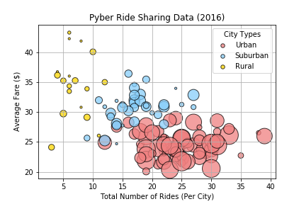

<!DOCTYPE html>
<html lang="en" dir="ltr">
  <head>
    <meta charset="utf-8">
    <title>Bootstrap Visualization Dashboard - Pyber Analysis</title>
  </head>
  <body>

    <h1>Summary: Opportunities in the Ride-Sharing Market</h1>

     

    

      
      The purpose of this project was to analyze the relationship between four key variables:
      average fare per city, total number of rides per city, total number of drivers per city, and the city type (urban, suburban, or rural).
      The dataset contained information about each of Pyber's active driver and historic rides, including details like city, driver count, individual fares, and city type.
      

  </body>
</html>
